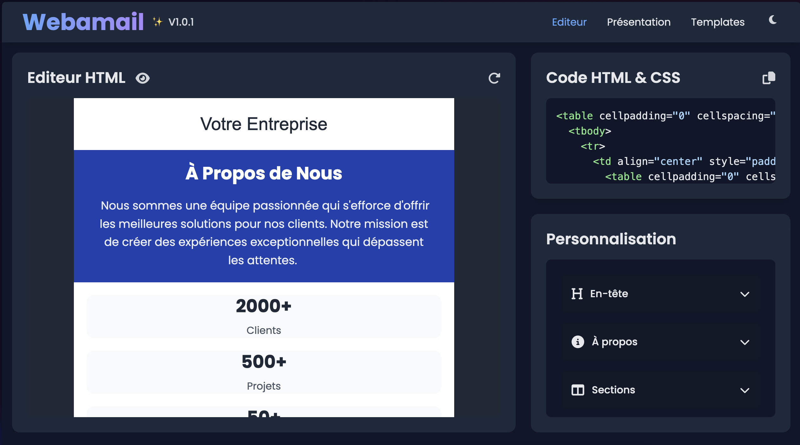
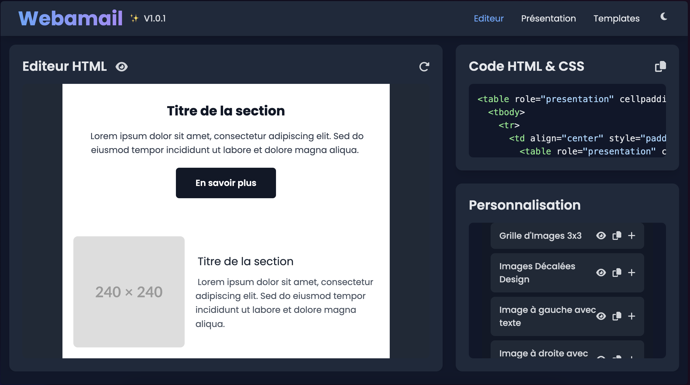
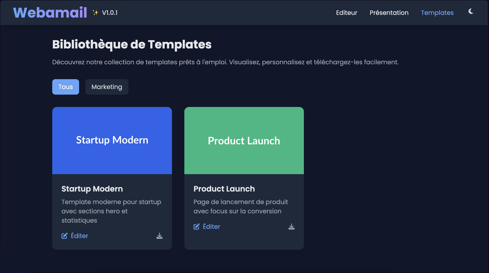

# Nom du Projet
Webamail (Version dérivée de Webazon.fr)

# Version
1.0.1

# Licence
MIT

## Description
Une application web pour l'édition graphique d'emails professionnels.

## Preview






## Auteur
Anthony Marandon --> https://anthonymarandon.fr

## Structure du Projet
```
webamail/
├── application/
│   └── public/
│       ├── css/
│       │   └── style.css              # Styles principaux de l'application
│       ├── js/
│       │   ├── components/
│       │   │   ├── customization.js   # Personnalisation de l'éditeur
│       │   │   ├── editor.js          # Composant principal de l'éditeur
│       │   │   ├── preview.js         # Prévisualisation des emails
│       │   │   └── state.js           # Gestion de l'état de l'application
│       │   ├── utils/
│       │   │   ├── dom.js             # Utilitaires manipulation DOM
│       │   │   ├── elementList.js     # Gestion des éléments
│       │   │   ├── html.js            # Manipulation HTML
│       │   │   ├── path.js            # Gestion des chemins
│       │   │   └── selective-copy.js   # Copie sélective
│       │   ├── assets.js              # Gestion des ressources
│       │   ├── config.js              # Configuration de l'application
│       │   ├── main.js                # Point d'entrée principal
│       │   ├── models.js              # Modèles de données
│       │   └── theme.js               # Gestion des thèmes
│       ├── images/
│       │   ├── clair.png              # Image thème clair
│       │   ├── sombre.png             # Image thème sombre
│       │   ├── templates.png          # Image des modèles
│       │   ├── preview.png            # Image de prévisualisation
│       │   └── release.png            # Image de version
│       ├── index.html                 # Page d'accueil
│       ├── app.html                   # Interface principale
│       ├── model.html                 # Page du modèle
│       └── version.html               # Informations de version
├── LICENCE                            # Fichier de licence
└── README.md                          # Documentation du projet
```

## Utilisation

L'application propose une suite complète d'outils pour la création d'emails professionnels, accessible via plusieurs points d'entrée :

### Points d'entrée principaux

- `index.html` : Page d'accueil et présentation
  - Vue d'ensemble des fonctionnalités
  - Démonstration des composants disponibles
  - Guide de démarrage rapide
  - Présentation de l'interface intuitive

- `app.html` : Interface principale de l'éditeur
  - Éditeur visuel WYSIWYG
  - Prévisualisation en temps réel
  - Personnalisation des styles
  - Bibliothèque de composants intégrée
  - Export du code HTML optimisé

- `model.html` : Galerie de templates
  - Collection de modèles professionnels
  - Templates par secteur d'activité
  - Personnalisation des modèles
  - Aperçu instantané des modifications

- `version.html` : Informations techniques
  - Notes de version
  - Historique des mises à jour
  - Compatibilité des navigateurs
  - Documentation technique

### Fonctionnalités clés

- Création rapide d'emails en moins de 5 minutes
- Interface intuitive avec prévisualisation en temps réel
- Bibliothèque complète de composants réutilisables
- Templates professionnels prêts à l'emploi
- Export de code HTML optimisé et compatible
- Support des thèmes clair et sombre
- Responsive design pour tous les clients mail

## Licence
Ce projet est sous licence [type-de-licence]. Voir le fichier `LICENCE` pour plus de détails.

